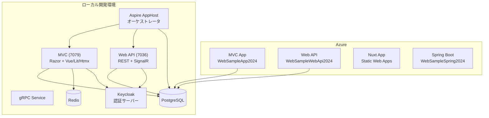
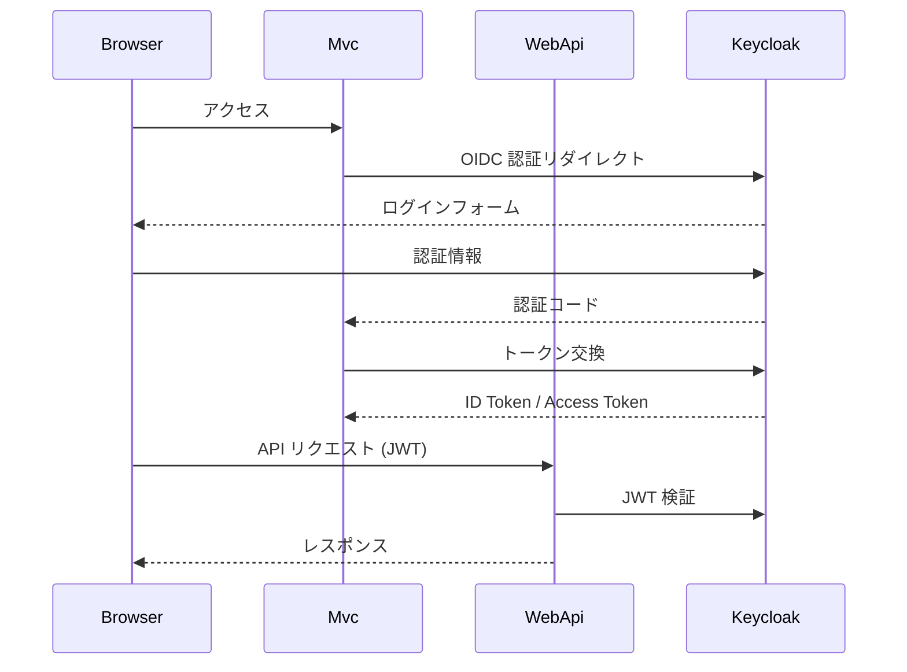

# アーキテクチャ概要

## 全体構成

## アプリケーション層

### MVC アプリケーション (`AspNetCoreSample.Mvc`)

- ASP.NET Core MVC + Razor ビュー
- Keycloak OIDC 認証（Cookie + OpenID Connect）
- Redis セッション管理
- Web Push API（VAPID）
- SignalR チャット
- フロントエンド: Vue.js、Lit、HTMX、Bootstrap、jQuery、Vite

### Web API (`AspNetCoreSample.WebApi`)

- ASP.NET Core Web API（コントローラーベース）
- Keycloak JWT Bearer 認証
- 動的認可ポリシー（DB からロール・ポリシーを取得）
- NSwag による OpenAPI / Swagger / ReDoc
- 多言語対応（ja / en）
- FluentValidation による入力検証
- SignalR Hub（QR コードリレー）

### gRPC サービス (`AspNetCoreSample.Grpc`)

- gRPC サーバー（Reflection 有効）
- `GreeterService` - Hello World サンプル

## データ層

### Entity Framework Core

`SampleContext` が PostgreSQL へのデータアクセスを担当します。

| エンティティ | 説明 |
| ------------ | ---- |
| `SampleTable` | メインサンプルテーブル（id, name, int, decimal, date, bit, audit） |
| `MultiTable` | 複合キーテーブル（id + charid） |
| `Name` | 簡易な名前エンティティ |
| `EnumSample` | Enum カラムのデモ |
| `ParentTable` | 親子関係の親テーブル |
| `ChildTable` | 親子関係の子テーブル（FK） |
| `Policy` | 認可ポリシー名 |
| `RolePolicy` | ロールとポリシーのマッピング（複合キー） |

## 認証・認可

- **MVC**: OIDC（Cookie + OpenID Connect）
- **Web API**: JWT Bearer 認証
- **NuxtSample**: keycloak-js（SPA）
- **動的ポリシー**: `CustomAuthorizationPolicyProvider` が DB からポリシーを動的解決

## 横断的関心事

| 関心事 | 実装 |
| ------ | ---- |
| ロギング | NLog（Fody `LoggingAttribute` でメソッドログ） |
| 監視 | OpenTelemetry（Aspire ServiceDefaults） |
| 検証 | FluentValidation（サーバー側 + クライアントアダプタ） |
| DI 静的アクセス | `ServiceProviderAccessor` |
| コード生成 | CodeGen CLI, T4, Kiota |
