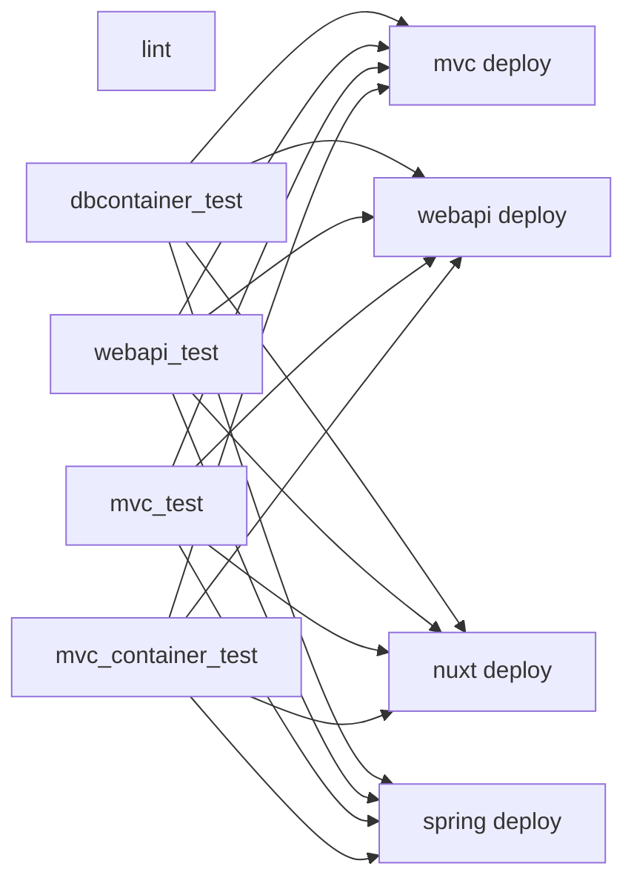

# CI/CD パイプライン

GitHub Actions で CI/CD を実行します。ワークフロー定義は `.github/workflows/main.yml` です。

## トリガー

`push` イベントで実行されます。

## ジョブ構成

## lint ジョブ

以下の静的解析を実施します。

| ツール | 対象 |
| ------ | ---- |
| `dotnet format --verify-no-changes` | C# ソリューション全体 |
| `prettier --check` | NuxtSample `app/**/*.{ts,vue,css}` |
| `eslint` | NuxtSample |
| `actionlint` | `.github/workflows/main.yml` |
| `markdownlint-cli2` | 変更された `*.md` |
| `textlint` | 変更された日本語 `*.md` |

## テストジョブ

| ジョブ | フレームワーク | 備考 |
| ----- | ------------- | ---- |
| `dbcontainer_test` | .NET 10.0 Release | PostgreSQL Testcontainer |
| `webapi_test` | .NET 10.0 Release | PostgreSQL + Keycloak Testcontainers, Verify |
| `mvc_test` | .NET 10.0 Release | Playwright ブラウザテスト |
| `mvc_container_test` | .NET 10.0 Release | Docker ビルド + Playwright |

## デプロイジョブ

`main` ブランチへの push 時、全テスト成功後に実行されます。

| ジョブ | デプロイ先 | 方式 |
| ----- | ---------- | ---- |
| `mvc` | `WebSampleApp2024` (Azure Web Apps) | `dotnet publish` → `azure/webapps-deploy@v2` |
| `webapi` | `WebSampleWebApi2024` (Azure Web Apps) | `dotnet publish` → `azure/webapps-deploy@v2` |
| `nuxt` | Azure Static Web Apps | `pnpm run generate` → `Azure/static-web-apps-deploy@v1` |
| `spring` | `WebSampleSpring2024` (Azure Web Apps) | Maven ビルド → `azure/webapps-deploy@v2` |

## 必要なシークレット

| シークレット | 用途 |
| ------------ | ---- |
| `MVC_AZURE_WEBAPP_PUBLISH_PROFILE` | MVC アプリのデプロイ |
| `WEBAPI_AZURE_WEBAPP_PUBLISH_PROFILE` | Web API のデプロイ |
| `AZURE_STATIC_WEB_APPS_API_TOKEN` | Nuxt のデプロイ |
| `SPRING_AZURE_WEBAPP_PUBLISH_PROFILE` | Spring Boot のデプロイ |
