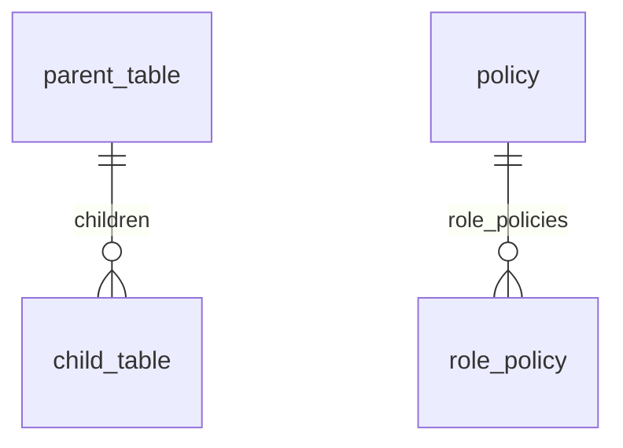

<!-- 自動生成: tools/modelgen generate。手編集禁止 -->
# 項目モデル

`model/` を Single Source of Truth として自動生成した関連グラフと一覧です。

## エンティティ関連グラフ

## サービス・イベントフロー

```mermaid
flowchart LR
    svc_audit_sink["監査シンク"]
    svc_data_api["データ API"]
    svc_security_api["セキュリティ管理 API"]
    ev_child_table_created(("child_table.created"))
    ev_child_table_deleted(("child_table.deleted"))
    ev_child_table_updated(("child_table.updated"))
    ev_enum_sample_created(("enum_sample.created"))
    ev_enum_sample_deleted(("enum_sample.deleted"))
    ev_enum_sample_updated(("enum_sample.updated"))
    ev_multi_table_created(("multi_table.created"))
    ev_multi_table_deleted(("multi_table.deleted"))
    ev_multi_table_updated(("multi_table.updated"))
    ev_name_created(("name.created"))
    ev_name_deleted(("name.deleted"))
    ev_name_updated(("name.updated"))
    ev_parent_table_created(("parent_table.created"))
    ev_parent_table_deleted(("parent_table.deleted"))
    ev_parent_table_updated(("parent_table.updated"))
    ev_policy_created(("policy.created"))
    ev_policy_deleted(("policy.deleted"))
    ev_role_policy_created(("role_policy.created"))
    ev_role_policy_deleted(("role_policy.deleted"))
    ev_role_policy_granted(("role_policy.granted"))
    ev_sample_table_created(("sample_table.created"))
    ev_sample_table_deleted(("sample_table.deleted"))
    ev_sample_table_updated(("sample_table.updated"))
    svc_data_api -->|publishes| ev_child_table_created
    svc_data_api -->|publishes| ev_child_table_deleted
    svc_data_api -->|publishes| ev_child_table_updated
    svc_data_api -->|publishes| ev_enum_sample_created
    svc_data_api -->|publishes| ev_enum_sample_deleted
    svc_data_api -->|publishes| ev_enum_sample_updated
    svc_data_api -->|publishes| ev_multi_table_created
    svc_data_api -->|publishes| ev_multi_table_deleted
    svc_data_api -->|publishes| ev_multi_table_updated
    svc_data_api -->|publishes| ev_name_created
    svc_data_api -->|publishes| ev_name_deleted
    svc_data_api -->|publishes| ev_name_updated
    svc_data_api -->|publishes| ev_parent_table_created
    svc_data_api -->|publishes| ev_parent_table_deleted
    svc_data_api -->|publishes| ev_parent_table_updated
    svc_security_api -->|publishes| ev_policy_created
    svc_security_api -->|publishes| ev_policy_deleted
    svc_security_api -->|publishes| ev_role_policy_created
    svc_security_api -->|publishes| ev_role_policy_deleted
    svc_security_api -->|publishes| ev_role_policy_granted
    svc_data_api -->|publishes| ev_sample_table_created
    svc_data_api -->|publishes| ev_sample_table_deleted
    svc_data_api -->|publishes| ev_sample_table_updated
    ev_policy_created -->|consumes| svc_audit_sink
    ev_policy_deleted -->|consumes| svc_audit_sink
    ev_role_policy_granted -->|consumes| svc_audit_sink
```

## エンティティ

| id | title | table | owner | 主キー | フィールド | 関係 |
| -- | ----- | ----- | ----- | ------ | ---------- | ---- |
| `child_table` | 子テーブル | `child_table` | team-sample | id | id, parent_id, child_name, child_int, child_decimal, child_date, child_bit, create_at, create_user, update_at, update_user | belongs-to→parent_table |
| `enum_sample` | Enum サンプル | `enum_sample` | team-sample | id | id, enum_column |  |
| `multi_table` | マルチテーブル | `multi_table` | team-sample | id, charid | id, charid, target_name, target_int, target_decimal, target_date, target_bit, create_at, create_user, update_at, update_user |  |
| `name` | 名前 | `name` | team-sample | id | id, name1 |  |
| `parent_table` | 親テーブル | `parent_table` | team-sample | id | id, target_name, target_int, target_decimal, target_date, target_bit, create_at, create_user, update_at, update_user | has-many→child_table |
| `policy` | ポリシー | `policies` | team-security | policy_name | policy_name | has-many→role_policy |
| `role_policy` | ロール・ポリシー割当 | `role_policies` | team-security | role_name, policy_name | role_name, policy_name | belongs-to→policy |
| `sample_table` | サンプルテーブル | `sample_table` | team-sample | id | id, target_name, target_int, target_decimal, target_date, target_bit, create_at, create_user, update_at, update_user |  |

## サービス

| id | title | owner | produces | consumes |
| -- | ----- | ----- | -------- | -------- |
| `audit_sink` | 監査シンク | team-security |  | policy.created, policy.deleted, role_policy.granted |
| `data_api` | データ API | team-sample | sample_table.created, sample_table.updated, sample_table.deleted, multi_table.created, multi_table.updated, multi_table.deleted, name.created, name.updated, name.deleted, enum_sample.created, enum_sample.updated, enum_sample.deleted, parent_table.created, parent_table.updated, parent_table.deleted, child_table.created, child_table.updated, child_table.deleted |  |
| `security_api` | セキュリティ管理 API | team-security | policy.created, policy.deleted, role_policy.created, role_policy.deleted, role_policy.granted |  |

## イベント

| id | source | trigger | 種別 | producers | consumers | data_fields |
| -- | ------ | ------- | ---- | --------- | --------- | ----------- |
| `child_table.created` | `child_table` | `entity.created` | 自動生成 | data_api |  | id, parent_id, child_name, child_int, child_decimal, child_date, child_bit, create_at, create_user, update_at, update_user |
| `child_table.deleted` | `child_table` | `entity.deleted` | 自動生成 | data_api |  | id |
| `child_table.updated` | `child_table` | `entity.updated` | 自動生成 | data_api |  | id, parent_id, child_name, child_int, child_decimal, child_date, child_bit, create_at, create_user, update_at, update_user |
| `enum_sample.created` | `enum_sample` | `entity.created` | 自動生成 | data_api |  | id, enum_column |
| `enum_sample.deleted` | `enum_sample` | `entity.deleted` | 自動生成 | data_api |  | id |
| `enum_sample.updated` | `enum_sample` | `entity.updated` | 自動生成 | data_api |  | id, enum_column |
| `multi_table.created` | `multi_table` | `entity.created` | 自動生成 | data_api |  | id, charid, target_name, target_int, target_decimal, target_date, target_bit, create_at, create_user, update_at, update_user |
| `multi_table.deleted` | `multi_table` | `entity.deleted` | 自動生成 | data_api |  | id, charid |
| `multi_table.updated` | `multi_table` | `entity.updated` | 自動生成 | data_api |  | id, charid, target_name, target_int, target_decimal, target_date, target_bit, create_at, create_user, update_at, update_user |
| `name.created` | `name` | `entity.created` | 自動生成 | data_api |  | id, name1 |
| `name.deleted` | `name` | `entity.deleted` | 自動生成 | data_api |  | id |
| `name.updated` | `name` | `entity.updated` | 自動生成 | data_api |  | id, name1 |
| `parent_table.created` | `parent_table` | `entity.created` | 自動生成 | data_api |  | id, target_name, target_int, target_decimal, target_date, target_bit, create_at, create_user, update_at, update_user |
| `parent_table.deleted` | `parent_table` | `entity.deleted` | 自動生成 | data_api |  | id |
| `parent_table.updated` | `parent_table` | `entity.updated` | 自動生成 | data_api |  | id, target_name, target_int, target_decimal, target_date, target_bit, create_at, create_user, update_at, update_user |
| `policy.created` | `policy` | `entity.created` | 自動生成 | security_api | audit_sink | policy_name |
| `policy.deleted` | `policy` | `entity.deleted` | 自動生成 | security_api | audit_sink | policy_name |
| `role_policy.created` | `role_policy` | `entity.created` | 自動生成 | security_api |  | role_name, policy_name |
| `role_policy.deleted` | `role_policy` | `entity.deleted` | 自動生成 | security_api |  | role_name, policy_name |
| `role_policy.granted` | `role_policy` | `command.grant_role_policy` | 意図イベント | security_api | audit_sink | role_name, policy_name |
| `sample_table.created` | `sample_table` | `entity.created` | 自動生成 | data_api |  | id, target_name, target_int, target_decimal, target_date, target_bit, create_at, create_user, update_at, update_user |
| `sample_table.deleted` | `sample_table` | `entity.deleted` | 自動生成 | data_api |  | id |
| `sample_table.updated` | `sample_table` | `entity.updated` | 自動生成 | data_api |  | id, target_name, target_int, target_decimal, target_date, target_bit, create_at, create_user, update_at, update_user |
